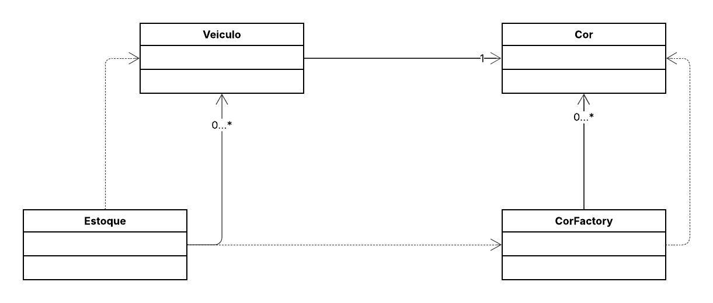

## 📦 Sistema de Gerenciamento de Estoque de Veículos (Flyweight)

Este projeto implementa o padrão de projeto estrutural **Flyweight**.

O objetivo é otimizar o uso de memória ao gerenciar grandes quantidades de objetos de **Veículo** que compartilham informações intrínsecas, como a **Cor**.

A classe `CorFactory` atua como um *pool* de objetos Flyweight, garantindo que o objeto `Cor` seja criado apenas uma vez para cada cor única (Ex: "Vermelho", "Azul") e seja reutilizado por múltiplos objetos `Veiculo` (que representam dados extrínsecos como `placa` e `modelo`).

-----

## 📌 Diagrama de Classes

-----
## 👩‍💻 Autora

**Eduarda Araujo Carvalho**
